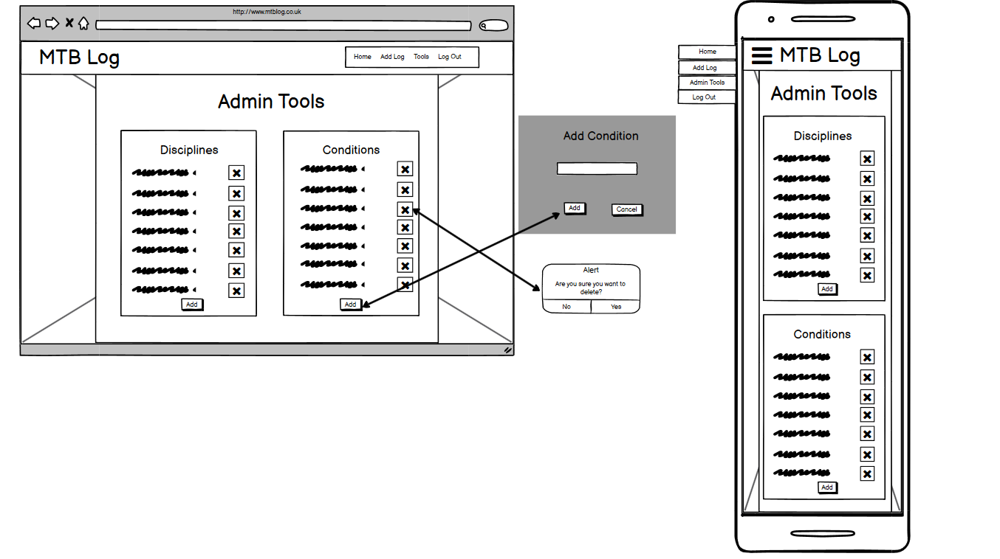

# MTB Log

MTB logs is an application to store logs of mountain bike (MTB) rides that allows anyone with access to the website to view other people’s logs. The application has a login system that allows users to create and log in to accounts. Users will have to log in to access other features which give the application the feel of a social media site. Admins will have their own front end page to add, remove, and edit dropdown options. The website will make use of CRUD to improve the ease of use of the logs.

Site link: [MTB Logs](https://mtb-logs.herokuapp.com/)

## UX

### Project Goals

The project is designed to make it easy to record mountain bike rides and trips. It will help to bring the community of riders together by making it easy for others to view other people’s rides with a search engine.

### User Stories

- As a user, I would like to be able to log any type of MTB ride and be able to update, edit and delete any log I have previously uploaded to the application 
- As a user, I would like to be able to view any ride that any other user has posted to the application
- As an admin,, I would like to be able to view any users logs and have the ability to edit and to delete any outdated or inappropriate content. 
- As an admin, I would also like to have control over what a user can add and be able to add and delete the items for the dropdown list to remove any updated content.
- As a software developer, I would like to be able to see the developer’s (James Gibbs) ability to make an application with a backend that interacts with MongoDB

### Wireframing

I used Balsamiq to create a wireframe for the application. The wireframe contains a basic responsive design for all of the pages on the website and a basic design of the database.

[PDF of Balsamiq design](static/pdf/MTBLog.pdf)

## Database

The database is made using mongoDB and contains four collections, user, logs, disciplines and conditions. I have chosen to store all the data in strings and ObjectIds as strings are the easiest to pull from a materialize CSS form.

### User

The collection stores each user's email, username and a hashed password. The email is stored so that in the future I can implement email validation for registration, as well as allowing users to reset their passwords if they forget them. The password has also been hashed using werkzeug so that the password cannot be viewed on the database which is a legal requirement.

### Logs

Upon registering each user will be assigned a user_ID. The user_id will be stored as an Object_ID because this will allow logs to be linked to an account even if the user's username changed.

### Discipline/conditions

I chose to store these in their own collection as it enables me to build an admin tool that can add and remove these objects to this database Improving the flexibility of the solution. 

## Features

### Existing Features

- **Home page** – When the user first enters the website they will be presented with the choice to either login or register an account. 
- **Login** – The login page will give the user a form to fill in with their username and password, these will be checked against the database allowing the user to login.
- **Register** – The register page will collect users’s emails, and allow them to generate a username and password. The password will be hashed and both pieces of data will be stored for future use.
- **Log Display** – On the main page the logs are pulled on to a materialize CSS collapsible div which makes the logs easy to view for the user.
- **Navigation Bar** – Allows intuitive navigation around the different pages of my web site.
- **CRUD** – The website allows users to create, read, update and delete any log that they have made on the website using forms and materialize CSS modals.
- **Admin Tools** – This allows the admin to interact with any log and allows gives them control over what selection the user has on the form.
- **Log out** –  Deletes session user and stops access to the main page until they are logged back in.

### Design Colours

- `#546E7A` - Login card
- `#26A69A` - Buttons
- `#EE6E73` - Header and navbar
- `#C8E6C9` - Container header
- `#E8F5E9` - Container Background
- `#D50000` - Delete button
- `#FFFFFF` - log header background and white text
- `#212121` - Black text
- `#9E9E9E` - Grey text

### Fonts

I used the default fonts of materialize as they suited the material theme I was going for.

### Images

I used two background images that were open-source and free to use. Find links to images in credits.

### Features Left to Implement

- Comments on logs
- Email verification
- Admin tools to change the username
- Google maps API implementations for the location of rides
- Unit testing for all functions

## Technologies Used

- [HTML5](https://en.wikipedia.org/wiki/HTML5) – Used to create the structure and content of the site
- [CSS3](https://en.wikipedia.org/wiki/Cascading_Style_Sheets#CSS_3) – Used to add styling and animations
- [MaterilizeCSS](https://materializecss.com/) – Used to add layout and responsiveness to elements as well as the fonts and colour scheme
- [Font Awesome](https://fontawesome.com/) – Used to add icons and link to social media
- [jQuery](https://en.wikipedia.org/wiki/JQueryhttps://en.wikipedia.org/wiki/JQuery) – Used for DOM manipulation
- [Python](https://www.python.org/) – The language used to write the backend
- [Flask](https://flask.palletsprojects.com/en/1.1.x/) - Python framework used to build backend
- [Werkzeug](https://werkzeug.palletsprojects.com/en/1.0.x/) - Used to hash passwords in the database
- [pytest](https://docs.pytest.org/en/stable/) - Used for unit testing
- [MongoDB](https://www.mongodb.com/1) - The database used to store relevant data
- [GitPod](https://gitpod.io/) – The IDE used for the project
- [Git](https://en.wikipedia.org/wiki/Git) – Used for the version Control
- [GitHub](https://github.com/) – Used to host the repository and the website itself
- [Balsamiq](https://balsamiq.com/?gclid=Cj0KCQjw-af6BRC5ARIsAALPIlVwDTVSWkIbHntu7SkngMVtBOZ10dgH0w_u8ZtRM3yz7F5kkM-31GwaAkFeEALw_wcB) - Used for first drawing
- [Google Sheets](https://docs.google.com/spreadsheets/u/0/) - Testing Spreadsheet

## Testing

### Testing Tools

- [W3C HTML validator](https://validator.w3.org/)– to test for errors in the HTML (a warning was found in section tag in HTML but this was ignored as the h2-h6 tag is not necessary)
- [W3C CSS validator](https://jigsaw.w3.org/css-validator/) - to test for errors in the CSS (warnings were found in materialize script but there were no warnings in the static file) 
- [PEP8 validator](https://www.python.org/dev/peps/pep-0008/) - to test format of python code (this function is built in to GitPod)
- [Firefox Developer Tool](https://developer.mozilla.org/en-US/docs/Tools) and [Chrome Developer Tools](https://developers.google.com/web/tools/chrome-devtools) – to test layout, styling, and responsiveness throughout the whole site and also used to test different screen sizes.
- [Google sheets](https://www.google.co.uk/sheets/about/) - to make an open spreadsheet that other people can edit the spreadsheet for physical testing

### Unit Testing

I used pytest to write a script to test the template file location. In the future, I would like to learn how to write tests for everything on the website.

[Physical Testing Spreadsheet](https://docs.google.com/spreadsheets/d/13pxFP6c3-Ro9Kfq3aMPr6MVmqYErxBQe_oHAo17Qv7k/edit?usp=sharing)

### User Stories

#### User Registration

1. Clicks Register
2. Types email, username, and password
3. Clicks Register
4. Redirected to Main Page

#### User Login

1. Clicks login
2. Types username and password in
3. Redirected to main a page

#### User Add Log

1. User Clicks Add log
2. Redirected to Add Log Page
3. User Fills Out form
4. User clicks Add Log
5. Redirected to Main Page
6. User sees log on Main Page

#### User Edit Log

1. User click the edit button on the log they want to edit
2. Redirected to edit page
3. User edits log on form
4. User clicks Edit Log
5. Redirected to the Main page
6. User sees Edited log

#### User Delete Log

1. User click Delete button on the log they want to delete
2. Model pops up asking if they want to delete
3. User clicks yes
4. Redirected to the main page
5. User sees log is gone

#### User Log Out

1. User Clicks Log Out
2. User Redirected to Login page

#### Admin Edit log (Admin username: Admin, Password: Admin1)

1. Admin click edit button on the log they want to edit
2. Redirected to edit page
3. Admin edits log on form
4. Admin clicks Edit Log
5. Redirected to the main page
6. Admin sees Edited log

#### Admin Delete Log

1. Admin click Delete button on the log they want to delete
2. Model pops up asking if they want to delete
3. Admin clicks yes
4. Redirected to the main page
5. Admin sees log is gone

#### Admin Add Discipline

1. Admin clicks Admin tools
2. Admin clicks Add on disciplines
3. Admin types discipline in text box
4. Admin clicks add
5. Admin clicks add log
6. Admin sees new discipline in the dropdown

#### Admin Delete Discipline

1. Admin clicks admin tools
2. Admin clicks delete button on discipline
3. Admin clicks add log
4. Admin sees that discipline is not there

#### Admin Add Condition

1. Admin clicks Admin tools
2. Admin clicks Add on conditions
3. Admin types condition in text box
4. Admin clicks add
5. Admin clicks add log
6. Admin sees new discipline in the dropdown

#### Admin Delete Condition

1. Admin clicks admin tools
2. Admin clicks delete button on condition
3. Admin clicks add log
4. Admin sees that condition is not there

### Testing Results

- I discovered that grade will sometimes be stored incorrectly as null
- No data validation on elevation and distance
- The rules defining a valid username are not clear enough
- Problem with using the website on safari (further testing required)

## Deployment

### Requirements for Deployment
- IDE of developers choice
- Python3 - running application
- MongoDB account - access database
- Heroku account

### Source code
The code for this project is stored on this [GitHub Repository](https://github.com/jamesigibbs/MS3-MTBLog)

##### To clone the repository:

1. Go to the repository
2. Under the repository name, click “Clone or Download”
3. Copy the clone url
4. Open the GIT bash terminal in your IDE
5. Type “git clone” and then paste the repository URL and hit enter

### Heroku Deployment

I used Heroku to deploy the application as it automatically enables pushes from my GitHub repository.

##### I used the following steps to deploy the website to Heroku:

1. Create a requirements.txt file using the terminal: `pip freeze > requirements.txt`
2. Create a profile using the terminal: echo web: `python app.py > Procfile`
3. Create a new app in Heroku with the region set to Europe
4. Set the deployment method to GitHub and link the repository
5. Set up the config vars in settings and set them to be identical to the env.py file
6. Click deploy branch

Please find the deployed site here [MTB Logs](https://mtb-logs.herokuapp.com/)

## Credits and Sources

### Content

- Navbar, form inputs, buttons, collapsible divs, Jquery, colours, and fonts were all taken from MaterializeCSS documentation and then modified
- Font Awesome provided all of the icons on the website
- Materialize Select Validation Script -- https://github.com/Code-Institute-Solutions/TaskManagerAuth/blob/main/04-AddingATask-WritingToTheDatabase/02-materialize-select-validation/static/js/script.js

### Media

- MTB Background IMG Source -- https://en.wikipedia.org/wiki/Mountain_bike#/media/File:Norco_Range.jpg
- Mountain Background IMG Source -- https://wallpaperscraft.com/download/mountain_sky_lake_summer_92505/1920x1080

### Acknowledgement

- I received help from Caleb Mbakwe who is my mentor
- I would also like to thank all the Code Institute tutors for helping me with this project
- I would also like to thank all my friends and family who helped me test the website

